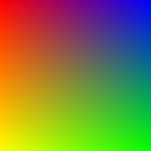
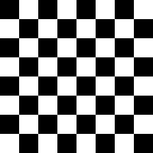

# Bismuth

This repository is a Scala port of the original Bismuth interpreter, which was
written in Haskell. I made this port while serving as a TA for CS 686: Program
Synthesis.

Bismuth is a small image-generation language implemented in Scala 3. A Bismuth
program describes an image with coordinate expressions, colors, masks,
arithmetic, transformations, and composition operators, then renders the result
as a PNG.




## Features

- Parse `.bi` source files with FastParse.
- Render procedural images to PNG.
- Use coordinate variables such as `x`, `y`, `r`, and `theta`.
- Work with named colors, grayscale values, RGB/RGBA colors, and masks.
- Combine images with arithmetic, boolean operators, overlay, and juxtaposition.
- Transform images with `scale`, `translate`, `rotate`, `swirl`, and `flip`.
- Render directories of `.bi` programs concurrently.

## Requirements

- JDK
- sbt 1.11.7 or newer

## Getting Started

Clone the repository and move into the SBT project:

```bash
git clone <repo-url>
cd Bismuth_Scala/bismuth
```

Compile and test the project:

```bash
sbt compile
sbt test
```

Build a runnable JAR:

```bash
sbt assembly
```

Render the included example programs:

```bash
java -jar target/scala-3.7.3/bismuth.jar src/test/resources/handwritten out
```

The renderer accepts an input directory, an output directory, and an optional
thread count:

```bash
java -jar target/scala-3.7.3/bismuth.jar <inputDir> <outputDir> [threads]
```

Every `.bi` file under the input directory is rendered to a matching `.png` file
under the output directory.

## Example Program

```bismuth
(128, 128);

circle = r < 1;
top = translate(0, 0.5, scale(1, 0.5, circle <..> circle));
bottom = y < (1 - 1/sqrt(2))/2 && y > x - 1/sqrt(2) && y > -x - 1/sqrt(2);
patch = scale(1/2, x < 1 && y < 1 && x > -1 && y > 0);

if scale(0.6, 0.8, top || bottom || patch) {
  red
} else {
  white
}
```

A program starts with the output resolution, followed by an expression that
evaluates to an image.

## Language Overview

### Values

- Named colors: `red`, `green`, `blue`, `yellow`, `black`, `white`
- Grayscale literals: `0`, `0.5`, `1`
- RGB/RGBA colors: `[r, g, b]` or `[r, g, b, a]`
- Booleans/masks: `true`, `false`
- Coordinates: `x`, `y`, `r`, `theta`

### Operators

- Arithmetic: `+`, `-`, `*`, `/`
- Comparison: `<`, `>`, `==`
- Boolean/mask logic: `&&`, `||`, `^`, `!`
- Horizontal juxtaposition: `<..>`
- Vertical juxtaposition: `<:>`

### Built-ins

- Math functions: `sin`, `cos`, `tan`, `sqrt`
- Constants: `pi`
- Transformations: `scale`, `translate`, `rotate`, `swirl`, `flip`
- Composition: `overlay`, `juxtapose`, `replicate`
- Conditionals: `if condition { thenExpr } else { elseExpr }`
- Bindings: `name = value; body`

## Project Layout

```text
bismuth/
  build.sbt
  project/
  src/main/scala/          Scala implementation
  src/test/scala/          Unit tests
  src/test/resources/      Example and parser test programs
  checkerboard.png         Sample output
  color-gradient.png       Sample output
```

## Development

Useful commands:

```bash
sbt compile
sbt test
sbt assembly
```

The main entry point is `bismuth.Main`, configured as `bismuth.all` in
`build.sbt`.
